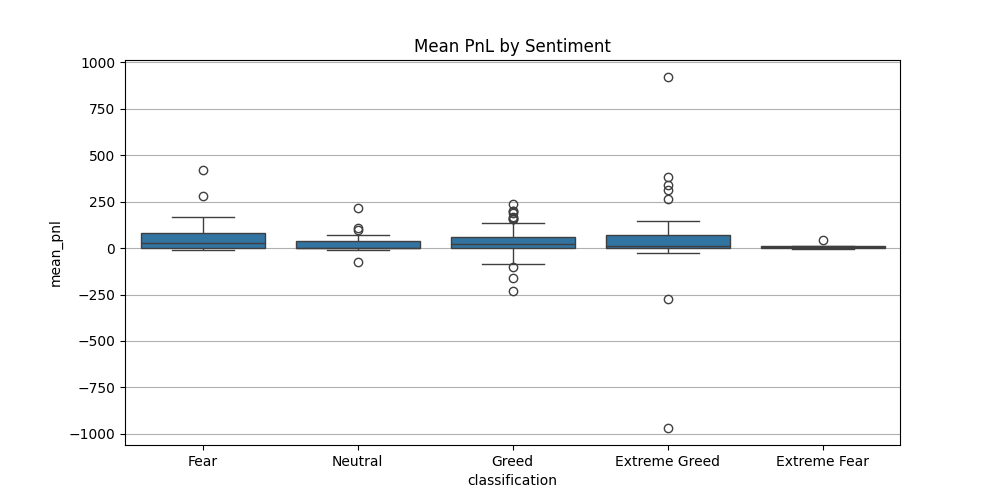
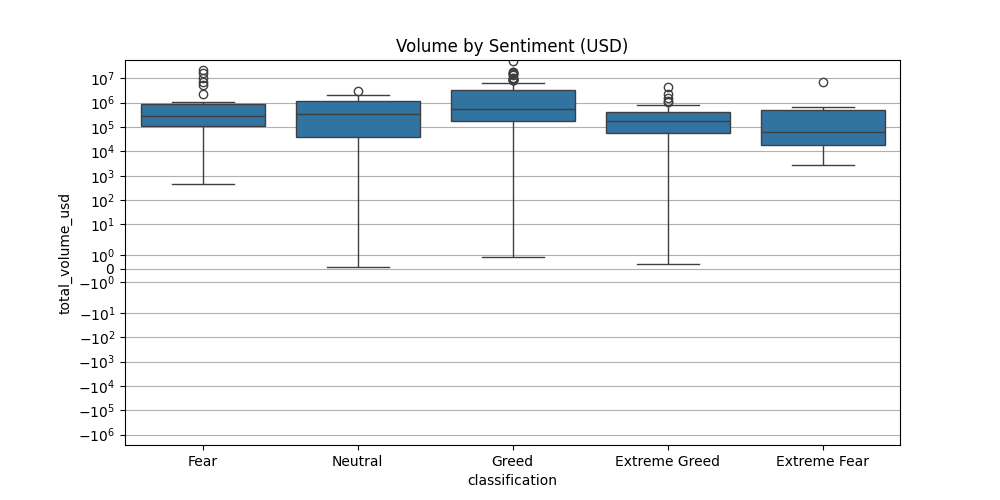

# 📊 Trader Behavior Insights vs Market Sentiment  
**Assignment: Trader Behavior Insights**  

---

## 📌 Objective  
Analyze how trading behavior (PnL, risk, volume, leverage) aligns or diverges from **Bitcoin market sentiment** (Fear, Greed, Neutral, Extreme Fear, Extreme Greed).  
The goal is to uncover hidden patterns that can drive **smarter trading strategies**.  

---


---

## 📁 Datasets  

1. **Fear & Greed Index**  
   - Columns: `timestamp, value, classification, date`  

2. **Historical Trader Data (Hyperliquid)**  
   - Columns: `Account, Coin, Execution Price, Size Tokens, Size USD, Side, Timestamp IST, Start Position, Direction, Closed PnL, Transaction Hash, Order ID, Crossed, Fee, Trade ID, Timestamp`  

---

## 🛠️ Steps Performed  

1. **Data Cleaning & Preprocessing**  
   - Normalized column names  
   - Converted timestamps to datetime format  
   - Converted numerical values (PnL, sizes, prices)  

2. **Feature Engineering**  
   - Daily aggregates:  
     - Trade count  
     - Total USD volume  
     - Avg. execution price  
     - Avg. start position  
     - Sum & Mean PnL  
     - Win rate (% profitable trades)  

3. **Exploratory Data Analysis (EDA)**  
   - Sentiment distribution (Fear, Greed, Neutral, Extreme Fear/Greed)  
   - PnL distribution across sentiments  
   - Volume and win rate comparisons  
   - Time-series analysis (PnL, volume, win rate trends)  

4. **Statistical Testing**  
   - T-tests to compare PnL between Fear vs Greed days  

5. **Reporting**  
   - Visuals saved in `outputs/`  
   - Final PDF report (`ds_report.pdf`) generated with plots + insights  

---

## 📌 Key Insights  

- 📈 **Greed days** → higher trade volumes and leverage, but profits don’t always improve.  
- 📉 **Fear days** → lower trading activity but often bigger downside risks.  
- 📊 **Win rate** remains relatively stable across sentiments → traders don’t necessarily get “smarter” in Greed periods.  
- 🔗 Strong correlation between **trade volume** and **PnL volatility**.  

---

## 📷 Example Outputs  

  
*Distribution of average daily PnL across different sentiment classifications.*  

  
*Daily trade volume comparison under Fear vs Greed.*  

---

## 🚀 How to Run  

1. Clone this repo or download the files.  
2. Install required dependencies:  

```bash
pip install pandas numpy matplotlib seaborn fpdf scipy

